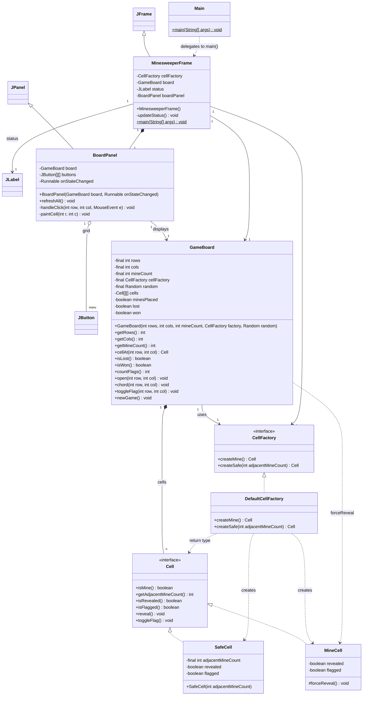

# Minesweeper — UML class diagram

```mermaid
classDiagram
  direction TB

  %% ---- javax.swing (abbreviated) ----
  class JFrame
  class JPanel
  class JButton
  class JLabel

  %% ---- minesweeper.model ----
  class Cell {
    <<interface>>
    +isMine() boolean
    +getAdjacentMineCount() int
    +isRevealed() boolean
    +isFlagged() boolean
    +reveal() void
    +toggleFlag() void
  }

  class MineCell {
    -boolean revealed
    -boolean flagged
    #forceReveal() void
  }

  class SafeCell {
    -final int adjacentMineCount
    -boolean revealed
    -boolean flagged
    +SafeCell(int adjacentMineCount)
  }

  class GameBoard {
    -final int rows
    -final int cols
    -final int mineCount
    -final CellFactory cellFactory
    -final Random random
    -Cell[][] cells
    -boolean minesPlaced
    -boolean lost
    -boolean won
    +GameBoard(int rows, int cols, int mineCount, CellFactory factory, Random random)
    +getRows() int
    +getCols() int
    +getMineCount() int
    +cellAt(int row, int col) Cell
    +isLost() boolean
    +isWon() boolean
    +countFlags() int
    +open(int row, int col) void
    +chord(int row, int col) void
    +toggleFlag(int row, int col) void
    +newGame() void
  }

  %% ---- minesweeper.factory ----
  class CellFactory {
    <<interface>>
    +createMine() Cell
    +createSafe(int adjacentMineCount) Cell
  }

  class DefaultCellFactory {
    +createMine() Cell
    +createSafe(int adjacentMineCount) Cell
  }

  %% ---- minesweeper.ui ----
  class BoardPanel {
    -GameBoard board
    -JButton[][] buttons
    -Runnable onStateChanged
    +BoardPanel(GameBoard board, Runnable onStateChanged)
    +refreshAll() void
    -handleClick(int row, int col, MouseEvent e) void
    -paintCell(int r, int c) void
  }

  class MinesweeperFrame {
    -CellFactory cellFactory
    -GameBoard board
    -JLabel status
    -BoardPanel boardPanel
    +MinesweeperFrame()
    -updateStatus() void
    +main(String[] args)$ void
  }

  %% ---- minesweeper ----
  class Main {
    +main(String[] args)$ void
  }

  %% Realization
  Cell <|.. MineCell
  Cell <|.. SafeCell
  CellFactory <|.. DefaultCellFactory

  %% Inheritance (Swing)
  JFrame <|-- MinesweeperFrame
  JPanel <|-- BoardPanel

  %% Associations / composition
  GameBoard "1" --> "1" CellFactory : uses
  GameBoard "1" *-- "n" Cell : cells
  BoardPanel "1" --> "1" GameBoard : displays
  BoardPanel "1" o-- "many" JButton : grid
  MinesweeperFrame "1" --> "1" CellFactory
  MinesweeperFrame "1" --> "1" GameBoard
  MinesweeperFrame "1" *-- "1" BoardPanel
  MinesweeperFrame "1" --> "1" JLabel : status

  %% Factory creates model types
  DefaultCellFactory ..> MineCell : creates
  DefaultCellFactory ..> SafeCell : creates
  DefaultCellFactory ..> Cell : return type

  %% GameBoard uses MineCell on loss
  GameBoard ..> MineCell : forceReveal

  %% Entry
  Main ..> MinesweeperFrame : delegates to main()
```

View this file in a Mermaid-capable preview (VS Code / Cursor with a Mermaid extension, GitHub, or [mermaid.live](https://mermaid.live)).
